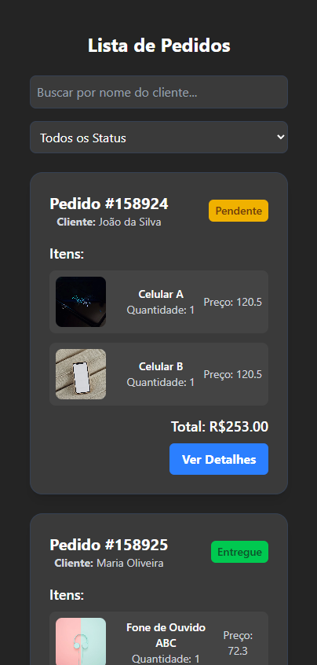
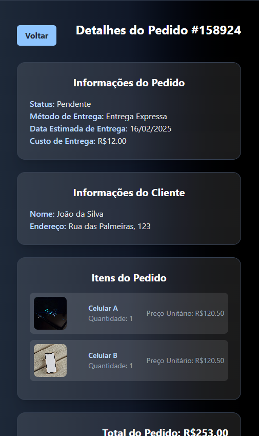
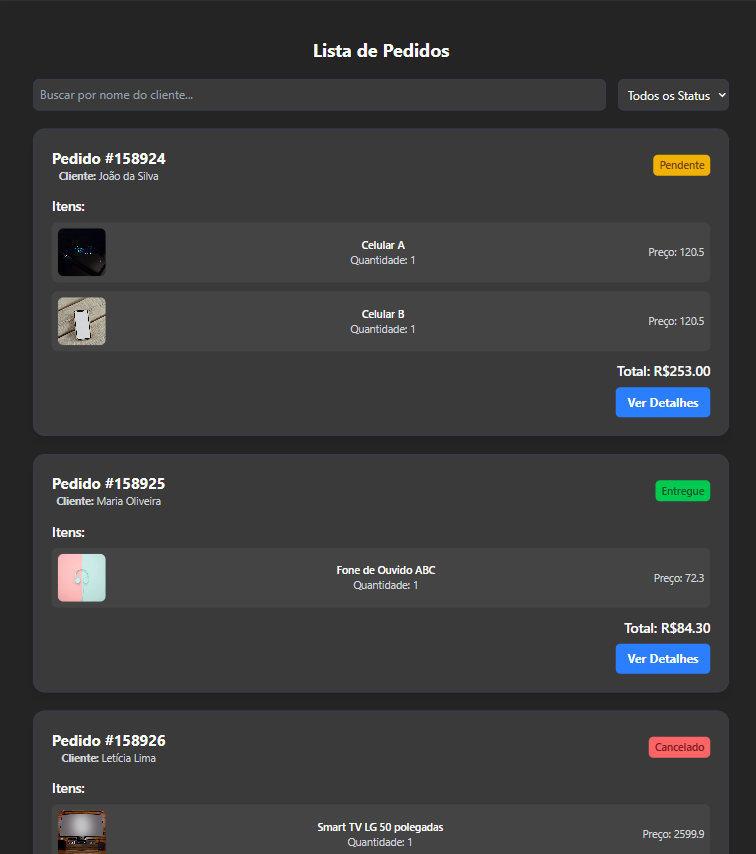
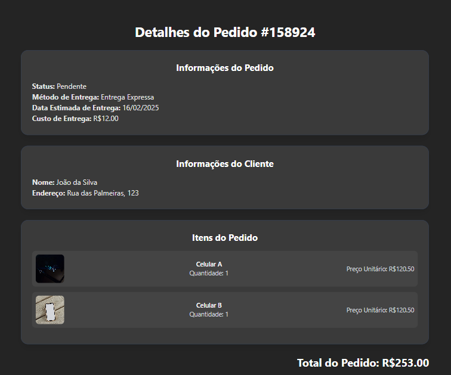

# 📢 Gerenciamento de Pedidos

Esta aplicação foi desenvolvida para gerenciar pedidos de entrega. O objetivo é exibir uma lista de pedidos e permitir que os usuários filtrem os pedidos por nome do cliente e status. Além disso, a aplicação permite visualizar os detalhes de um pedido específico.

## 🚀 Funcionalidades

- 📝 **Lista de Pedidos**: Exibe todos os pedidos com informações básicas, como ID, status, total, custo de entrega e data de entrega estimada.
- 🔍 **Filtros**: Permite buscar pedidos por nome do cliente ou status.
- 📋 **Detalhes do Pedido**: Exibe informações detalhadas sobre o pedido selecionado, incluindo os itens comprados e o valor total.
- 🌙 **Tema Escuro**: A interface utiliza um tema escuro moderno.

## 🛠️ Tecnologias Utilizadas

- **Frontend**: React.js, TypeScript, TailwindCSS
- **Gerenciamento de Estado**: React Hooks
- **Roteamento**: React Router
- **Testes**: Jest
- **Formatação e Qualidade de Código**: ESLint

## 📂 Estrutura do Projeto

```
order-manager/
│-- src/
│   │-- components/       # Componentes reutilizáveis da interface
│   │-- pages/            # Componentes das páginas (Lista de Pedidos, Detalhes do Pedido, etc.)
│   │-- routes/           # Rotas da aplicação
│   │-- utils/            # Funções auxiliares e mock de dados
│   │-- types/            # Tipos do TypeScript
│   │-- App.tsx           # Componente principal da aplicação
│-- public/               # Arquivos estáticos
│-- package.json          # Metadados e dependências do projeto
│-- README.md             # Documentação do projeto
```

## 🎯 Como Rodar a Aplicação

1. Clone o repositório:
   ```sh
   git clone https://github.com/leclm/order-manager.git
   cd order-manager
   ```

2. Instale as dependências:
   ```sh
   npm install
   ```

3. Inicie o servidor de desenvolvimento:
   ```sh
   npm run dev
   ```

4. Acesse a aplicação no navegador em [http://localhost:5174](http://localhost:5174)


## 📸 Screenshots

| Home Mobile | Details Mobile
|-----------|-------------|
|  |  |

| Home Desktop | Details Desktop
|-----------|-------------|
|  |  |


## 🛠️ Estrutura de Dados

A estrutura JSON usada para simular os pedidos contém as seguintes propriedades:

```json
{
  "orders": [
    {
      "uuid": "6f0945f1-6a83-4dfd-93bb-3242314196",
      "id": "158924",
      "status": "Pendente",
      "total": 120.50,
      "delivery_cost": 12.00,
      "shipping_method": "Entrega Expressa",
      "delivery_estimated": "2025-02-17",
      "customer": {
        "name": "João da Silva",
        "address": "Rua das Palmeiras, 123"
      },
      "items": [
        {
          "imagem": "https://via.placeholder.com/150",
          "name": "Celular XYZ",
          "quantity": 1,
          "price": 120.50
        }
      ]
    },
    {
      "uuid": "6f0945f1-6a83-4dfd-93bb-3242314197",
      "id": "158925",
      "status": "Entregue",
      "total": 72.30,
      "delivery_cost": 12.00,
      "shipping_method": "Entrega Normal",
      "delivery_estimated": "2025-02-17",
      "customer": {
        "name": "Maria Oliveira",
        "address": "Av. Paulista, 987"
      },
      "items": [
        {
          "imagem": "https://via.placeholder.com/150",
          "name": "Fone de Ouvido ABC",
          "quantity": 1,
          "price": 72.30
        }
      ]
    }
  ]
}
```
